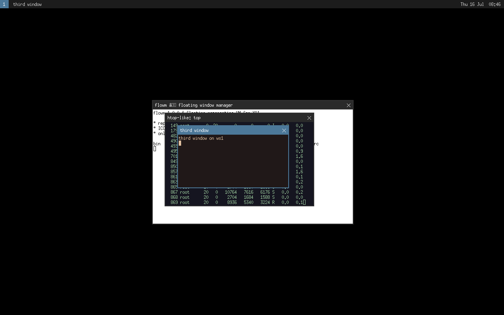
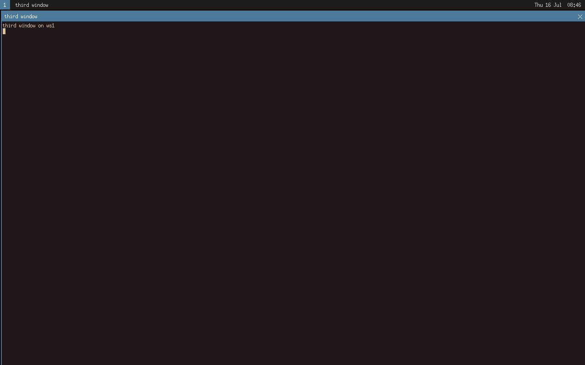
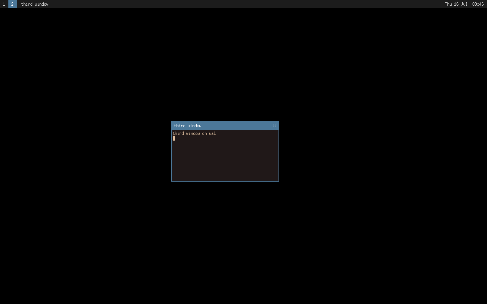
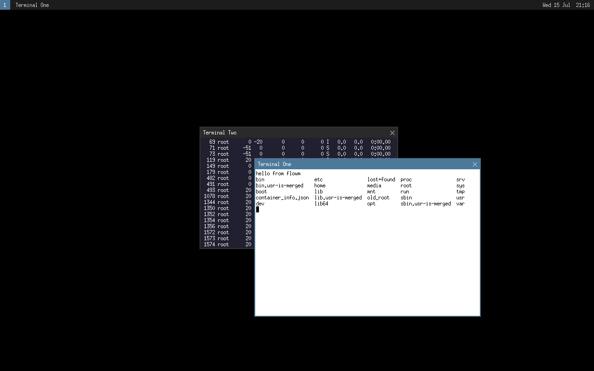

# flowm

A small, floating, window manager for X11 written in
C99 with a single dependency: libX11.

## Screenshots

| | |
|---|---|
|  |  |
|  |  |

## Building

Requirements: a C99 compiler, POSIX make, libX11 headers
(`libx11-dev` on Debian/Ubuntu, `libX11-devel` on Fedora).

```sh
make            # build ./flowm
make test       # run the parser unit tests (no X server needed)
make debug      # ASan/UBSan build
sudo make install
```

## Running

From a bare console / display manager `~/.xinitrc`:

```sh
exec flowm
```

Options: `-c FILE` (explicit config), `-d` (debug logging to stderr),
`-v` (version), `-h` (help).

## Default key bindings

| Chord | Action |
|---|---|
| `Mod4+Return` | spawn `xterm` |
| `Mod4+d` | spawn `dmenu_run` |
| `Mod4+q` / `Mod4+Shift+q` | close / kill window |
| `Mod4+f` / `Mod4+m` / `Mod4+c` / `Mod4+s` | fullscreen / maximize / center / sticky |
| `Mod4+Tab` / `Mod4+Shift+Tab` | cycle focus |
| `Mod4+r` / `Mod4+l` | raise / lower |
| `Mod4+Arrows` | move window |
| `Mod4+Shift+Arrows` | resize window |
| `Mod4+Ctrl+Left` / `Mod4+Ctrl+Right` | snap to left / right half |
| `Mod4+1..9` | switch workspace |
| `Mod4+Shift+1..9` | send window to workspace |
| `Mod4+.` / `Mod4+,` | next / previous workspace |
| `Mod4+Shift+e` | quit flowm |

All of these can be redefined; see `flowm.conf` and `flowm(1)`.

## Configuration

flowm looks for `$XDG_CONFIG_HOME/flowm/flowm.conf` (falling back to
`~/.config/flowm/flowm.conf`). The shipped `flowm.conf` documents every
option. A missing file just means defaults.

## License

MIT, see `LICENSE`.
